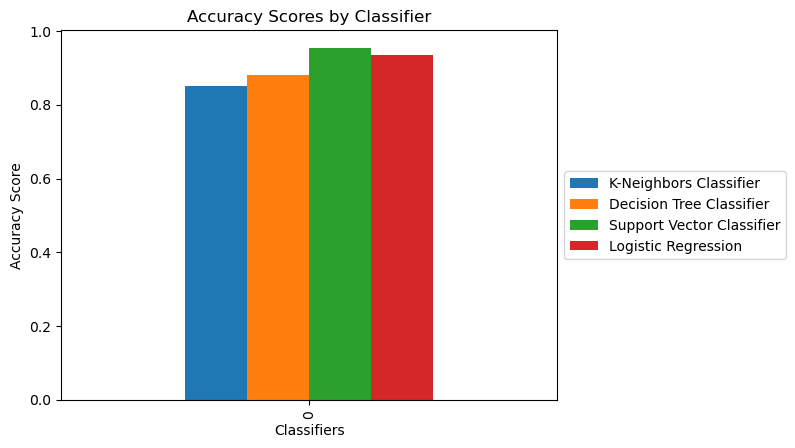

# Titanic Survivors Predictor

### This is my attempt to solve a Kaggle ML competition to predict the survivors of the Titanic disaster. 
### Using the Sklean Python library, I developed a SVM model that is able predict which passengers survived with an accuracy score of 0.95.

```python
import os
for dirname, _, filenames in os.walk('/kaggle/input'):
    for filename in filenames:
        print(os.path.join(dirname, filename))
```

    /kaggle/input/titanic/train.csv
    /kaggle/input/titanic/test.csv
    /kaggle/input/titanic/gender_submission.csv


# Loading the data


```python
# import necessary libraries
import numpy as np 
import pandas as pd 

# Load data from CSV files
df_train = pd.read_csv("/kaggle/input/titanic/train.csv")
df_test = pd.read_csv("/kaggle/input/titanic/test.csv")
target = pd.read_csv("/kaggle/input/titanic/gender_submission.csv")
```


```python
# Display last 5 rows of the dataframe to get an idea about its nature
df_train.tail()
```


<div>
<style scoped>
    .dataframe tbody tr th:only-of-type {
        vertical-align: middle;
    }

    .dataframe tbody tr th {
        vertical-align: top;
    }

    .dataframe thead th {
        text-align: right;
    }
</style>
<table border="1" class="dataframe">
  <thead>
    <tr style="text-align: right;">
      <th></th>
      <th>PassengerId</th>
      <th>Survived</th>
      <th>Pclass</th>
      <th>Name</th>
      <th>Sex</th>
      <th>Age</th>
      <th>SibSp</th>
      <th>Parch</th>
      <th>Ticket</th>
      <th>Fare</th>
      <th>Cabin</th>
      <th>Embarked</th>
    </tr>
  </thead>
  <tbody>
    <tr>
      <th>886</th>
      <td>887</td>
      <td>0</td>
      <td>2</td>
      <td>Montvila, Rev. Juozas</td>
      <td>male</td>
      <td>27.0</td>
      <td>0</td>
      <td>0</td>
      <td>211536</td>
      <td>13.00</td>
      <td>NaN</td>
      <td>S</td>
    </tr>
    <tr>
      <th>887</th>
      <td>888</td>
      <td>1</td>
      <td>1</td>
      <td>Graham, Miss. Margaret Edith</td>
      <td>female</td>
      <td>19.0</td>
      <td>0</td>
      <td>0</td>
      <td>112053</td>
      <td>30.00</td>
      <td>B42</td>
      <td>S</td>
    </tr>
    <tr>
      <th>888</th>
      <td>889</td>
      <td>0</td>
      <td>3</td>
      <td>Johnston, Miss. Catherine Helen "Carrie"</td>
      <td>female</td>
      <td>NaN</td>
      <td>1</td>
      <td>2</td>
      <td>W./C. 6607</td>
      <td>23.45</td>
      <td>NaN</td>
      <td>S</td>
    </tr>
    <tr>
      <th>889</th>
      <td>890</td>
      <td>1</td>
      <td>1</td>
      <td>Behr, Mr. Karl Howell</td>
      <td>male</td>
      <td>26.0</td>
      <td>0</td>
      <td>0</td>
      <td>111369</td>
      <td>30.00</td>
      <td>C148</td>
      <td>C</td>
    </tr>
    <tr>
      <th>890</th>
      <td>891</td>
      <td>0</td>
      <td>3</td>
      <td>Dooley, Mr. Patrick</td>
      <td>male</td>
      <td>32.0</td>
      <td>0</td>
      <td>0</td>
      <td>370376</td>
      <td>7.75</td>
      <td>NaN</td>
      <td>Q</td>
    </tr>
  </tbody>
</table>
</div>


# Handling missing values


```python
# Check for missing values in the training set
df_train.isna().sum()
```


    PassengerId      0
    Survived         0
    Pclass           0
    Name             0
    Sex              0
    Age            177
    SibSp            0
    Parch            0
    Ticket           0
    Fare             0
    Cabin          687
    Embarked         2
    dtype: int64


```python
# "Embarked" column only has 2 missing values so lets drop them
df_train = df_train.dropna(subset=['Embarked'])

# Since the "Age" and "Cabin" collumns contains a large ammount of NaN values I decided to impute them 
```

# Splitting the data into X/Y training and test sets


```python
Y_train = df_train['Survived']
X_train = df_train.drop(['Name', 'PassengerId', 'Survived'], axis=1)
Y_test = target['Survived']
X_test = df_test.drop(['Name', 'PassengerId'], axis=1)
```

# Preprocessing numerical and categorical variables


```python
# Display info about the training data and its columns
X_train.info()
```

    <class 'pandas.core.frame.DataFrame'>
    Int64Index: 889 entries, 0 to 890
    Data columns (total 9 columns):
     #   Column    Non-Null Count  Dtype  
    ---  ------    --------------  -----  
     0   Pclass    889 non-null    int64  
     1   Sex       889 non-null    object 
     2   Age       712 non-null    float64
     3   SibSp     889 non-null    int64  
     4   Parch     889 non-null    int64  
     5   Ticket    889 non-null    object 
     6   Fare      889 non-null    float64
     7   Cabin     202 non-null    object 
     8   Embarked  889 non-null    object 
    dtypes: float64(2), int64(3), object(4)
    memory usage: 69.5+ KB


```python
from sklearn.compose import make_column_selector as selector

# Select numerical and categorical columns
num_col_selector = selector(dtype_exclude=object)
cat_col_selector = selector(dtype_include=object) 

num_col, cat_col = num_col_selector(X_train), cat_col_selector(X_train)
```


```python
from sklearn.preprocessing import OneHotEncoder, StandardScaler
from sklearn.impute import SimpleImputer

# Initialize a preprocessor for both collumn types 
encoder = OneHotEncoder(handle_unknown="ignore")
scaler = StandardScaler()

# Initialize imputers as well
num_imputer = SimpleImputer(strategy='mean')
cat_imputer = SimpleImputer(strategy='most_frequent')
```


```python
from sklearn.pipeline import make_pipeline

# Place them inside pipelines
numeric_transformer = make_pipeline(num_imputer, scaler)
categorical_transformer = make_pipeline(cat_imputer, encoder)
```


```python
from sklearn.compose import ColumnTransformer

# Initialize the main preprocessor
preprocessor = ColumnTransformer([ ('num', numeric_transformer, num_col), ('cat', categorical_transformer, cat_col) ])
```

# Testing multiple ML classifiers and comparing their accuracy scores


```python
from sklearn.neighbors import KNeighborsClassifier
from sklearn.tree import DecisionTreeClassifier
from sklearn.svm import SVC
from sklearn.linear_model import LogisticRegression

# Initializing the models 
model_KNN = make_pipeline(preprocessor, KNeighborsClassifier())
model_DTC = make_pipeline(preprocessor, DecisionTreeClassifier())
model_SVC = make_pipeline(preprocessor, SVC())
model_LR = make_pipeline(preprocessor, LogisticRegression())
```


```python
# Training the models
model_KNN.fit(X_train, Y_train)
model_DTC.fit(X_train, Y_train)
model_SVC.fit(X_train, Y_train)
_ = model_LR.fit(X_train, Y_train)
```


```python
import matplotlib.pyplot as plt
# Display the accuracy scores for each classifier.
results = pd.DataFrame(zip([model_KNN.score(X_test, Y_test)],
                 [model_DTC.score(X_test, Y_test)],
                 [model_SVC.score(X_test, Y_test)],
                 [model_LR.score(X_test, Y_test)]
                ),
             columns=['K-Neighbors Classifier',
                      'Decision Tree Classifier',
                      'Support Vector Classifier',
                      'Logistic Regression']
            )

plot = results.plot.bar()
plt.title('Accuracy Scores by Classifier')
plt.xlabel('Classifiers')
plt.ylabel('Accuracy Score')
plot.legend(loc='center left', bbox_to_anchor=(1, 0.5))

plt.show()
```


    

    


```python
# Save the output
output = pd.DataFrame(zip(df_test['PassengerId'], model_SVC.predict(X_test)), columns=["PassengerId", "Survived"])
output.to_csv("/kaggle/working/output.csv")
```
